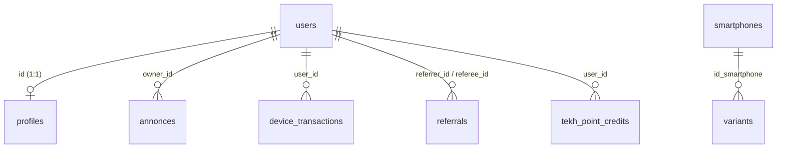

# Audit de la Base de Données TEKH+

Ce rapport présente l'analyse complète de l'architecture de données de TEKH+ basée sur Supabase, incluant la structure des tables, les clés étrangères, la sécurité (RLS) et la pertinence du modèle pour le swap et le diagnostic de smartphones.

---

## 1. Tables Principales et Relations (Clés Étrangères)

Le schéma s'articule autour de tables clés modélisant le cycle de vie du diagnostic, de la logistique, des récompenses et du parrainage :

### Table `profiles` (Profils Utilisateurs)
* **Description** : Étend les données d'authentification de Supabase (`auth.users`).
* **Attributs clés** : `id` (PK, FK → `auth.users`), `role` (user/admin), `referral_code`, `total_co2_saved`, `reward_status` (none, eligible_reward, reward_claimed).

### Table `device_transactions` (Logistique de Swap)
* **Description** : Gère les étapes logistiques du diagnostic physique de l'appareil jusqu'à sa finalisation.
* **Attributs clés** : `id` (PK), `user_id` (FK → `auth.users`), `device_name`, `price_fcfa`, `status` (Estimé, Déposé, Transit, Arrivé, Expertise, Prêt, Terminé), `tracking_number`, `metadata` (JSONB pour données de diagnostic).

### Table `referrals` (Système de Parrainage)
* **Description** : Suit les parrainages entre utilisateurs pour encourager l'engagement communautaire.
* **Attributs clés** : `id` (PK), `referrer_id` (FK → `auth.users`), `referee_id` (FK → `auth.users`, Unique), `status` (pending, converted, flagged), `converted_at`.

### Table `annonces` (Deals P2P / Marketplace)
* **Description** : Modélise les annonces de téléphones déposées par les utilisateurs pour le commerce d'occasion.
* **Attributs clés** : `id` (PK), `owner_id` (FK → `auth.users`), `title`, `brand`, `model`, `condition`, `price`, `status` (draft, published, archived), `images` (JSONB).

### Table `smartphones` (Référentiel Prix et Spécifications)
* **Description** : Cache local du catalogue de smartphones avec prix de référence (PRT) et caractéristiques techniques issus de scrapings et d'eBay.
* **Attributs clés** : `id` (PK), `marque`, `modele`, `variante`, `annee_sortie`, `classe_tekh` (A à F), `specs` (JSONB), `prt_fcfa`.

### Table `tekh_point_credits` (Récompenses & Crédits)
* **Description** : Consigne les crédits de points de fidélité actifs pour les transactions de swap et de parrainage.
* **Attributs clés** : `id` (PK), `user_id` (FK → `auth.users`), `amount_fcfa`, `status` (active, used, expired, cancelled), `expires_at`.

---

## 2. Évaluation de la Sécurité des Données (RLS)

Toutes les tables critiques disposent de politiques de sécurité au niveau des lignes (**Row Level Security - RLS**) strictement configurées et durcies via le script `security_hardening.sql`.

| Table | RLS Activée ? | Politiques Appliquées | Évaluation Sécurité |
| :--- | :---: | :--- | :--- |
| `profiles` | **Oui** | Lecture publique authentifiée (`true`) ; Écriture réservée à l'utilisateur (`auth.uid() = id`). | **Excellente** (pas d'injection de profil tierce). |
| `device_transactions` | **Oui** | Insertion/Lecture/Mise à jour restreinte au propriétaire (`auth.uid() = user_id`) ; Accès complet aux administrateurs (`role = admin`). | **Excellente** (protection des flux de transactions). |
| `referrals` | **Oui** | Lecture par le parrain ou le parrainé (`auth.uid() = referrer_id OR referee_id`) ; Insertion uniquement pour le parrainé (`auth.uid() = referee_id`). | **Excellente** (évite l'auto-parrainage ou l'usurpation). |
| `annonces` | **Oui** | Lecture publique pour les deals publiés ; Contrôle complet pour le propriétaire de l'annonce (`auth.uid() = owner_id`) et pour l'admin. | **Très Bonne** (conforme aux exigences de marketplace). |
| `smartphones` | **Oui** | Lecture publique (`true`) ; Écriture interdite pour les utilisateurs standards (réservée au `service_role` backend). | **Parfaite** (les utilisateurs ne peuvent pas corrompre le catalogue). |
| `tekh_point_credits` | **Oui** | Lecture restreinte au bénéficiaire (`auth.uid() = user_id`) ; Écriture bloquée pour les clients (réservée à l'admin/système). | **Parfaite** (sécurisation financière des crédits). |

* **Points de vigilance résolus** : Restructuration des fonctions en `SECURITY DEFINER` avec un `search_path` explicite à `public` pour éliminer les risques d'élévation de privilèges ou d'injection par usurpation de schéma.

---

## 3. Points Forts de la Modélisation pour TEKH+

1. **Pipeline Réactif & Événementiel via Triggers PL/pgSQL** :
   * La transition automatique d'une transaction logistique à l'état `Terminé` déclenche instantanément la conversion du parrainage (`converted_at`), qui à son tour recalcule les gains en CO2 du parrain et attribue l'éligibilité aux récompenses si le palier de 5 parrainages est atteint. Tout cela s'exécute côté base de données de manière transactionnelle et atomique.
2. **Utilisation stratégique de JSONB** :
   * Les caractéristiques spécifiques des téléphones (specs matérielles dans `smartphones.specs`) et les paramètres avancés de diagnostic (logs de diagnostic IA dans `device_transactions.metadata`) exploitent des champs `JSONB`. Cela permet d'absorber l'hétérogénéité des modèles de téléphones sans alourdir le schéma relationnel.
3. **Double niveau de catalogue (smartphones + variants)** :
   * L'organisation isole le modèle de base du stockage/RAM spécifique. Cela permet un cache mémoire efficace en frontend et des requêtes optimisées pour l'estimation automatique.
